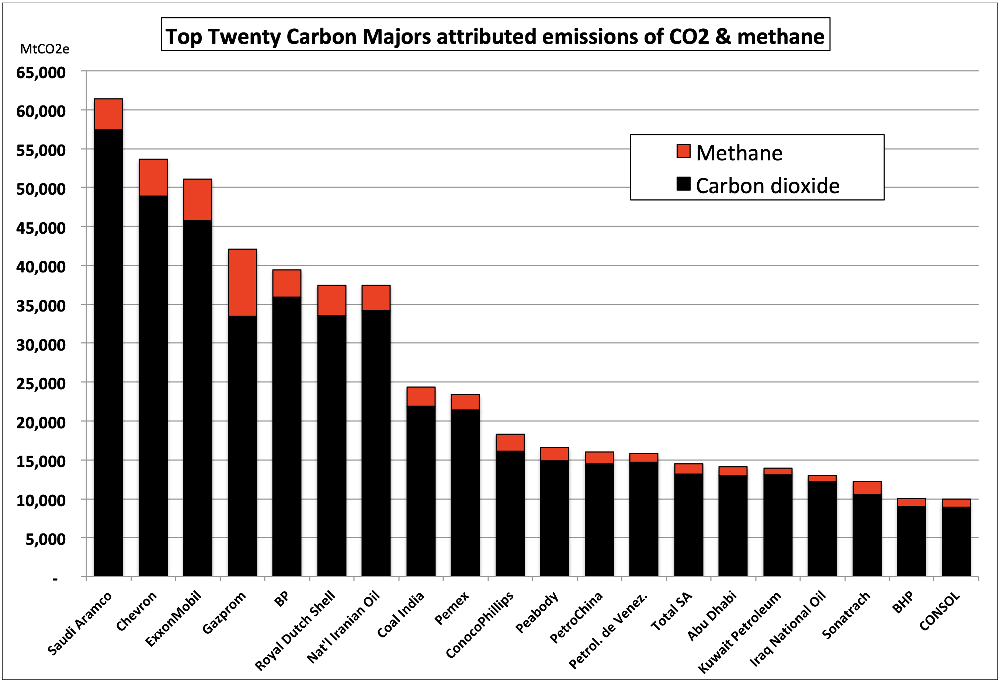
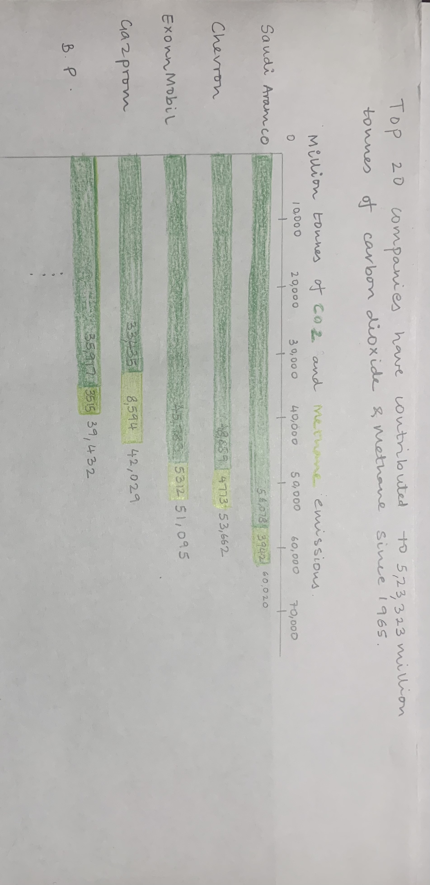
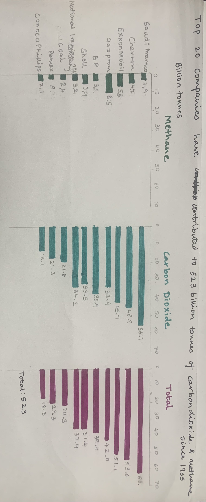

# Critique and Redesign
This task involves choosing a visualization, critiquing and redesigning it to make it more meaningful and impactful. 

## Finding a Data Visualization
I chose the following image:

Source: Richard Heede, Climate Accountability Institute. 
[Link to source](https://climateaccountability.org/pdf/CarbonMajorsPDF2020/Top%20Twenty%20graphics/Top%20Twenty%20graphics/TopTwenty%201854-2018%20Clmn%20CO2CH4.png)

This image depicts the carbon dioxide and methane emissions of the Top 20 companies. The red values are methane emissions andbalck values are carbon dioxide. At a first glance, this visualization may seem unimportant to the audience. However, the data tells a much powerful story that has not been captured. These 20 companies together have emitted 523 billion tonnes of carbon dioxide and methane since 1854. They have contributed to approximately 30% of all carbon dioxide and methane since 1854. The severity of this lies in the fact that seven and a half billion people suffer a degraded planet so that some companies can make larger profits. This data is important to draw the attention of policy makers, politicians, climate activists and the general public so that they can enforce laws to bring this under control. At a time when the world and industries are trying to move towards sustainability and green initiatives, it is important to identfy areas that require a change. This is the reason I chose this graph. I aim to make this graph more readable, so that it is approachble even by the general public.I aim to highlight the emissions by these companies and the country where most of these companies are located.

## Critique the data visualization

The visualization is able to convey the idea of the top 20 companies contributing to emissions of carbon dioxide and methane. The stacked bar graph is arranged in descending order which draws the attention towards the companies contributing the most following the natural direction of eye movement. Hence, the chart is useful. However, the visualization lacks in some other areas mention in the "Data Visualization Effectiveness Profile".
The chart lacks completeness since it is difficult to figure out and compare the individual carbon dioxide and methane amounts. This also required extra eye travel.
It suffers from low perceptibility due to several reasons. The title does not catch the user’s attention. Most of the people might not know the meaning of the term "Carbon Majors attributed emissions". The meaning of the y axis label “MtCO2e” is also not obvious to the user. The abbreviations used in title and axis label are not intuitive for most people.  The colors are not appealing or contrasting to the audience which affects the aesthetics and engagement of the chart. Infact, the black and red colors are distracting.

I would change the graph to a horizontal stacked bar graph for better readibility since the company names will also be easy to connectto the bar graph. I will mention total amount of carbon emissions(methane + carbon dioxide) near each bar to reduce the effort the reader has to put to determine the numbers. I would change the colors to different shades of the same color like green or contrasting colors, like blue and yellow/orange to increase the appeal and make the distinction more obvious. I would change the title to something like “Top 20 companies contributed to 523,323 million tonnes of carbon dioxide & methane emissions since 1854“. I would also change the y axis label to “Million tonnes of carbon dioxide and methane emissions” to make the metric clear to the observer.

## Sketch out a solution
Following the observations in the critique, I sketched out two different solutions.

### Horizontal Stacked Bar Chart

I converted the the chart horizontal bar chart with the methane amounts to the right and carbon dioxide amount to the left. This follows the usual eye movement, makes it easy to read the bar of each company.I included the x-axis values at the top so that the user can understand the value with minimal eye travel. I also added the total values at the end of each bar and individual emission values to improve readability. I changed the x-axis value label to "Million tonnes of carbon dioxide and methane" to make the metric clear to the audience.I changed the color to dark green and light green for carbon dioxide and methane to make the distinction more obvious. I added a title "Top 20 companies contributed to 523,323 million tonnes of carbon dioxide & methane emissicons since 1854" to explain the purpose of the graph.

### Convert Stacked bar to three columns with bar graphs

The second solution was to split the stacked bar graph into three different bar charts with different colors - carbon dioxide,methane and total. This would eliminate the confusion regarding the individual amounts of carbon dioxide and methane. Choice of title and the use of horizontal bar chart had the same motivation as the previous solution. I changed the metric to billion tonnes to make the numbers more readable and reduce the clutter on the graph. I also added the total emissions by all companies.

## Test the solution
I tested both the solutions with three users using the following questions as a script:
- Can you tell me what you think this is?
- Can you describe to me what this is telling you?
- Is there anything you find surprising or confusing?
- Who do you think is the intended audience for this?
- How would you change this to make it better?

My aim was to compare the two solutions to choose the one that the audeince resonates with and compare the strenghts and weaknesses of each.
Description of the users:
-User 1 - student, early 20s
-User 2 - student, mid 20s
-User 3 - student, late 20s

#### Feedback for Horizontal stacked chart
- Can you tell me what you think this is?
Response:
User 1 - Bar chart
User 2 - Bar charts, shows emissions 
User 3 - bar chart comparing emissions of different countries 

- Can you describe to me what this is telling you?
Response:
 - User 1 - Which companies have more emisisons 
 - User 2 - 20 companies contribute to large amount of emissions, emission amounts of each company for carbon dioxide, methane and total are shown
 - User 3 - carbon dioxide,methane and total emission of 20 companies 

- Is there anything you find surprising or confusing?
Response:
 - User 1 - colors are not contrasting 
 - User 2 - cannot compare individual emissions. Maybe because of color or methane has less amount but is towards the end
 - User 3 - there would be too many numbers if all 20 companies are shown, not heard of all the companies-where are these companies located

- Who do you think is the intended audience for this?
Response:
 - User 1 - Policy makers, government 
 - User 2 - Policy makers
 - User 3 - Government, climate activists

- How would you change this to make it better?
Response:
 - User 1 - Try contrasting colors
 - User 2 - different colors, add methane first and then carbon dioxide
 - User 3 - show less numbers, add percentages to make it more intuitive

#### Feedback for Convert Stacked bar to three column bar chart
- Can you tell me what you think this is?
Response:
 - User 1 - Bar charts
 - User 2 - Bar charts, shows emissions 
 - User 3 - Three bar charts to show carbon dioxide,methane and total emission according to companies

- Can you describe to me what this is telling you?
Response:
 - User 1 - Which companies have more emisisons 
 - User 2 - 20 companies contribute to large amount of emissions, three charts show emissions of company for carbon dioxide, methane and total
 - User 3 - carbon dioxide,methane and total emission of 20 companies

- Is there anything you find surprising or confusing?
Response:
- User 1 - Too much information, need to traverse two charts to get to the total which is important. Not sure where all the comapnies are
- User 2 - Total is more important than individual amounts, methane values are too small and difficult to compare
- User 3 - making the metric same is good for uniform comparison, but methane valuea are too small. Too many numbers

- Who do you think is the intended audience for this?
Response:
- User 1 - Policy makers, government 
- User 2 - Policy makers
- User 3 - Governemnt, climate activists

- How would you change this to make it better?
Response:
 - User 1 - Try a color scale that sums and use the final color for total. For eg. red(methane) + blue(carbon dioxide) which gives purple(total). 
 - User 2 - Show only total since that's important.
 - User 3 - Add percentages to make it more intuitive, change colors. 

### Observations
Similarities:
- The horizontal bar chart performed better than the three column bar chart
- Color choices for both charts were not intuitive 
- Too many numbers on three column bar chart. Horizontal stacked was comparatively better 
- Add percentage emissions 

Differences:
- Scale for methane in the 3 column chart. Some liked the uniformity, some thought the smaller amounts made the difference negligible due to same scale.
 
Patterns:
- They were only concerned about the total value and the individual amounts of emissions were not as important as long as they could compare it
- Eye travel is from left to right. Users look for information from left to right. 

Lessons learnt:
- Giving too muhc information confuses the audience
- Simple is always better
- Having a percentage contribution of each company would be more intuitive for the users to understand the impact

Changes:
- Use horizontal bar chart with contrasting colors for methane and carbon dioxide
- Add a chart with percentage contribution 
- Add countries with the company names 
-  Methane values which are usually less should be moved to the left so that eye travel goes from least amount, to a greater amount and finally the total number
- Highlight the title in a way that makes the message of the visualization more clearly and make numbers in bold

## Build your solution
I used a horizontal bar chart since the three column chart was confusing for users. I used contrasting colors of orange and green to indicate levels of methane and carbon dioxide distinctly. I also added the countries of the companies to make it more intuitive for the users. Other changes like having the axis labels on top and changing metric to billions has a similar as the initial solution prototype. Only the total emission values were mentioned since I noticed that users did not focus on the individual values alot. I initially had a the title "Top 20 companies have contributed to 523 billion tonnes of carbon dioxide and methane since 1854", but during the class feedback I noted that some users found this to be too long and wordy. So I made the title short and added a subtitle with explanation. Some ideas like the use of numbers in bold, contrasting colors and having the axis on top received positive response.

<noscript></noscript><object class='tableauViz'  style='display:none;'><param name='host_url' value='https%3A%2F%2Fpublic.tableau.com%2F' /> <param name='embed_code_version' value='3' /> <param name='site_root' value='' /><param name='name' value='CarbonEmissions_16685818006560&#47;Dashboard1' /><param name='tabs' value='no' /><param name='toolbar' value='yes' /><param name='static_image' value='https:&#47;&#47;public.tableau.com&#47;static&#47;images&#47;Ca&#47;CarbonEmissions_16685818006560&#47;Dashboard1&#47;1.png' /> <param name='animate_transition' value='yes' /><param name='display_static_image' value='yes' /><param name='display_spinner' value='yes' /><param name='display_overlay' value='yes' /><param name='display_count' value='yes' /><param name='language' value='en-GB' /><param name='filter' value='publish=yes' /></object>

I added a chart which shows the percentage emission of each company. The aim of this chart is to highlight that 20 companies contribute to approximately 30% of the carbon emissions. The darker bars represent companies with higher emisisons, and the light blue bars are countries with lower emissions.The motivation behind this was a suggestion during the user testing of the solutions. During the class feedback, users confirmed that the first chart sets the context and the second graph makes the message more clear and is more intuitive. 

<noscript></noscript><object class='tableauViz'  style='display:none;'><param name='host_url' value='https%3A%2F%2Fpublic.tableau.com%2F' /> <param name='embed_code_version' value='3' /> <param name='site_root' value='' /><param name='name' value='CarbonEmissions2_16685821574040&#47;Dashboard2' /><param name='tabs' value='no' /><param name='toolbar' value='yes' /><param name='static_image' value='https:&#47;&#47;public.tableau.com&#47;static&#47;images&#47;Ca&#47;CarbonEmissions2_16685821574040&#47;Dashboard2&#47;1.png' /> <param name='animate_transition' value='yes' /><param name='display_static_image' value='yes' /><param name='display_spinner' value='yes' /><param name='display_overlay' value='yes' /><param name='display_count' value='yes' /><param name='language' value='en-GB' /><param name='filter' value='publish=yes' /></object>

  
  
 Finally, I included a chart to show that out of the 20 companies that contribute to maximum emissions, 5 are based in the United States. This is an important message for policy makers, climate activists and government who can then implement policies to bring this under control. This was an observation I made while adding country names to companies. I also thought of grouping the companies by countries using color, but this would increase the colors on the graph. So I chose to highlight United States and depict other countries in grey.

<noscript></noscript><object class='tableauViz'  style='display:none;'><param name='host_url' value='https%3A%2F%2Fpublic.tableau.com%2F' /> <param name='embed_code_version' value='3' /> <param name='site_root' value='' /><param name='name' value='CarbonEmissions3&#47;Dashboard3' /><param name='tabs' value='no' /><param name='toolbar' value='yes' /><param name='static_image' value='https:&#47;&#47;public.tableau.com&#47;static&#47;images&#47;Ca&#47;CarbonEmissions3&#47;Dashboard3&#47;1.png' /> <param name='animate_transition' value='yes' /><param name='display_static_image' value='yes' /><param name='display_spinner' value='yes' /><param name='display_overlay' value='yes' /><param name='display_count' value='yes' /><param name='language' value='en-GB' /><param name='filter' value='publish=yes' /></object>

## Go back to Main Page
[Main Page](https://shreyaoswal21.github.io/storytelling-with-data)
