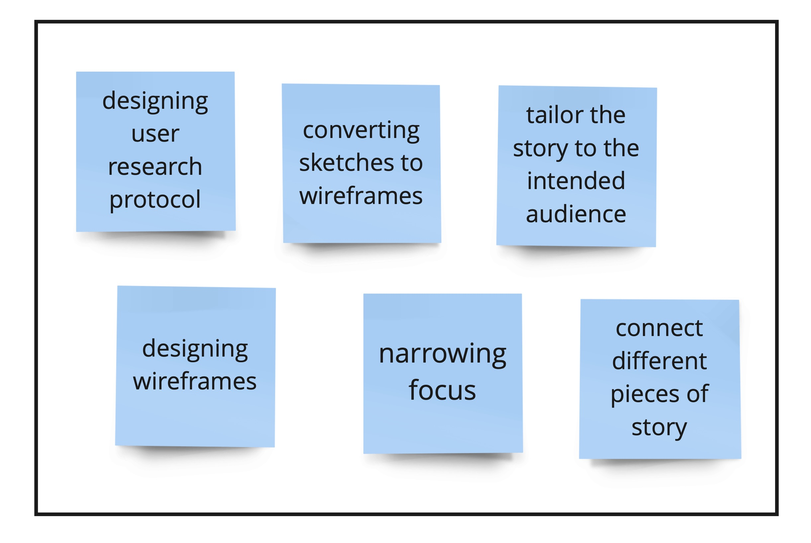

# Story so far:
[Part 1](finalprojectpart1.md) introduced the idea for the final project - What happens to your memeory when you sleep? The aim was to discuss the importance of sleep in retaining and consolidating memory so that students are encouraged to improve their sleep schedule.

#### Learnings

[Part 2](final project-part2.md) incorporated feedback from part 1 to narrow the focus. I decided to talk about the importance of sleep, discuss different sleep stages and how it affects memory, discuss effects of caffeine and screen times on sleep and present clear call to actions. This part also presented high fidelity graphs that i intended to use. After the user testing, in class critique and feedback from grading, these were the proposed changes:

- Include statistics on the effect of screen time on sleep
- Add reasons for bad sleep schedule
- Include correlation between sleep and academics and grades
- Change the graph for the Coffee Consumption Time takes time taken to fall asleep since the size of circles is confusing users. Use the shorthand feature to show how each time affects time taken to fall asleep, in ascending order
- Keep the graph for the Coffee Consumption Time takes time taken to fall asleep and remove 1-2 graphs from the coffee to focus the attention
- Add the meaning of placebo
- Reduce content on the slide for coffee
- Change color of the sleep cycles graph since it is not inline with the color theme
- 
#### Learnings

# Part 3
### Link to shorthand site for final project part 3
[Journey Through Sleep](https://carnegiemellon.shorthandstories.com/journey-through-sleep/index.html)

### Link to shorthand site for final project presentation
[Journey Through Sleep Presentation](https://carnegiemellon.shorthandstories.com/journey-through-sleep-presentation/index.html)

From the proposed changes, I did the priority exercise to narrow down the changes that could be implemented based on feasibility vs value to user:

I made the changes marked in green and did not make the changes marked in red. 
Here are a few important changes:
- Added reasons for sleeping late by students
- I changed the color of the graphs for sleep and also added the percentages of time spent in each cycle. Here is a comparison of the original vs the final visualization:

- I also changed the graph for effect of coffee consumption on time taken to fall asleep with focus on each element as users scroll

- Added statistics for the effect of screen time on sleep efficiency and time taken to fall asleep.
.png)

### Story
For my final story, I wanted to bring to the attention the importance of sleep. We spend one-thris of our life sleeping and this is an important activity for our overall functioning, especially the brain. It plays an important role in the functioning of memory and different stages of sleep affect the memory in different ways, which is depicted in the story. Next, I show how 60% of students are sleep deprived and article that shows how Carnegie Mellon University students are amongst the most sleep deprived in the country. I discuss a research that suggested slpeeing before 2 am to get the full effect of sleep. On the contrary, the mean sleeping time for studnets at Carnegie Mellon University is 2:23 am. Further I list common reaons stated by students for lack of sleep which includes academic reasons. However, in the same survey, students also reported that lack of sleep affects their performance. This means that students realize the importance of sleep but still have a bad sleep schedule. The project then focuses on important steps that led to poor sleep and how students can change their sleep health.

Consumption of caffeine, especially coffee is an essential part of university students since it helps them stay alert and avoid falling asleep. Consumption of caffeince closer to bedtime reduces sleep efficiency and increases time taken to fall asleep. Using excessive amount of screens through mobile phones and laptop has a similar effect. Increase in screen time in the evening, reduces sleep efficiency and increases time taken to fall asleep.

Students can make difference by avoiding consumption of caffeine 6 hours prior to sleeping and avoiding use of screens 1 hpur before sleeping. Other measures such as getting a full 7-8 hours of sleep, sleeping before 2 am and developing a consistent sleep schedule and also help.

### Audience
My audience was college students since they have the potential to improve their sleep schedule and also improve their learning. They are in a phase where learning fast and retaining knowledge is important but they are also very sleep deprived. I aim to bring to attention the imoportance of slepe and how students can sleep better
### Narrow down focus
During the user research and interviews, I observed that users were more moved by statistics and how certain habits like consuming caffeine and spending more screen time close to bedtime negatively affects.Hence, I tried to spend more time and and tried to make those visuals stronger.
### Adjustments to make it work for my audience
User research revealed that users would like to see the reasons why students sleep late. Instead of providing generic reasons, I looked for reasons why students at Carnegie Mellon University sleep late. This specificallu helped me during the presentation since my audience included students from Carnegie Mellon University, and this can usually be extended to students from any university. I also added statistics on how students feel insufficient sleep led to poor academic performance.
### Design Decisions 
I avoided bright colors in the project since my topic was sleep and I wanted to introduce that effect in my presentataion, so I used colors like orange and yellow.

## Learnings
- Importance of user research in understanding the audience and knowing what they want. It helped me understand the gaps between my thought process and audience expecations and modify my visualiations and stories accordingly. For instance, reducing the number of graphs I had on coffee. 
- Colors and sizes can play a big role in helping the user follow your story. Using circle size and focusing on one element by dipicting other elements in grey helped to compare sleep efficiency and narrow the focus to one element.
- Statistics play an important role in convinving users to make a chnage 

## References

Aminoff, Michael, François Boller, and Dick Swaab. 2011. “We Spend about One-Third of Our Life Either Sleeping or Attempting to Do So.” Handbook of Clinical Neurology / Edited by P.J. Vinken and G.W. Bruyn 98 (January): vii. https://doi.org/10.1016/B978-0-444-52006-7.00047-2.

Roser, Max, Esteban Ortiz-Ospina, and Hannah Ritchie. 2013. “Life Expectancy.” Our World in Data, May. https://ourworldindata.org/life-expectancy.

Patel, Aakash K., Vamsi Reddy, Karlie R. Shumway, and John F. Araujo. 2022. Physiology, Sleep Stages. StatPearls [Internet]. StatPearls Publishing. https://www.ncbi.nlm.nih.gov/books/NBK526132/.

“Sleep On It.” 2017. NIH News in Health. May 31, 2017. https://newsinhealth.nih.gov/2013/04/sleep-it.

“Sleep and Academic Performance Statistics & Sleep Tips for College Students.” 2021. Research.Com. March 22, 2021. https://research.com/education/sleep-and-academic-performance-statistics.

“Carnegie Mellon Students Are among the Most Sleep-Deprived in the Country.” n.d. Accessed December 9, 2022. https://thetab.com/us/cmu/2016/04/22/carnegie-mellon-students-among-sleep-deprived-country-122.

“Life@CMU Report Finds Campus Is Indeed Stressed out - The Tartan.” n.d. Accessed December 9, 2022. http://thetartan.org/2019/10/28/news/life-at-cmu.

Drake, Christopher, Timothy Roehrs, John Shambroom, and Thomas Roth. n.d. “Caffeine Effects on Sleep Taken 0, 3, or 6 Hours before Going to Bed.” Journal of Clinical Sleep Medicine 09 (11): 1195–1200. https://doi.org/10.5664/jcsm.3170.

“Study: Better Sleep Habits Lead to Better College Grades.” n.d. MIT News.Massachusetts Institute of Technology. Accessed December 9, 2022. https://news.mit.edu/2019/better-sleep-better-grades-1001.

“The Effects of Screen Time on Your Sleep Schedule. RMHP Blog.” n.d. Accessed December 9, 2022. https://www.rmhp.org/blog/2021/january/the-effects-of-screen-time-on-your-sleep-schedule.

“Screens and Your Sleep: The Impact of Nighttime Use. Sutter Health.” n.d. Accessed December 9, 2022. https://www.sutterhealth.org/health/sleep/screens-and-your-sleep-the-impact-of-nighttime-use.

Hjetland, Gunnhild J., Jens C. Skogen, Mari Hysing, and Børge Sivertsen. 2021. “The Association Between Self-Reported Screen Time, Social Media Addiction, and Sleep Among Norwegian University Students.” Frontiers in Public Health 9. https://www.frontiersin.org/articles/10.3389/fpubh.2021.794307.

# Back to main page
[Main Page](https://shreyaoswal21.github.io/storytelling-with-data)

