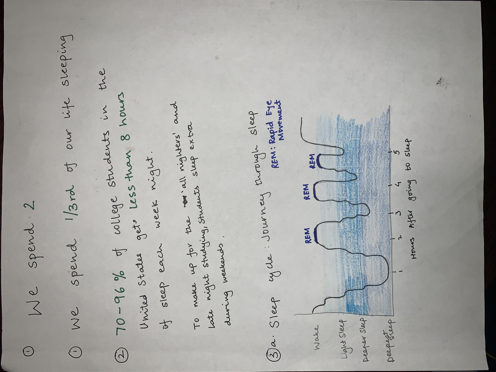
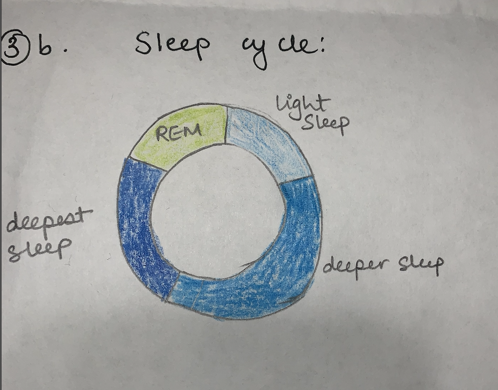
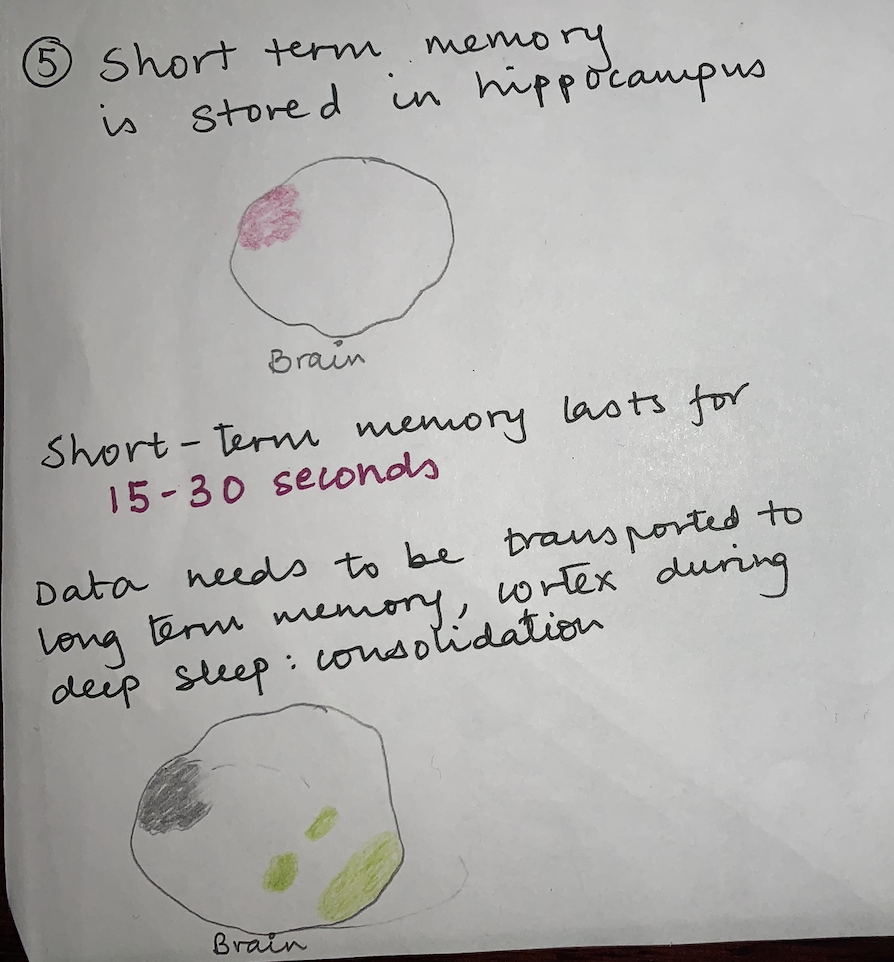
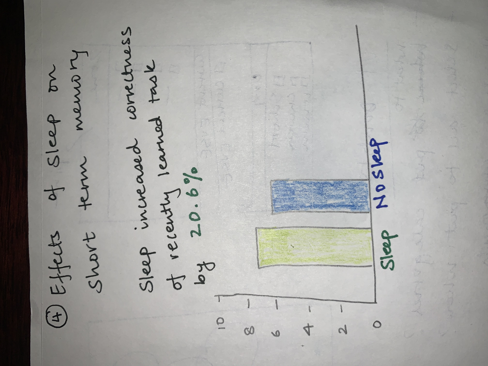
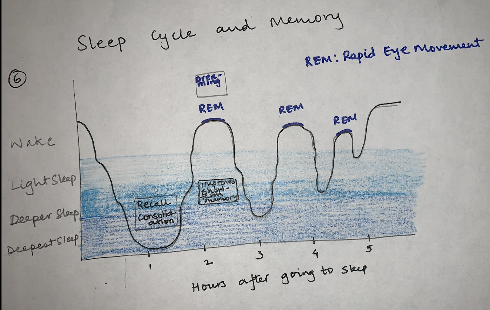

# Final Project Part 1

#### What happens to your memory when you sleep?

People usually spend the major portion of their lives sleeping. This activity is important for the functioning of the body and the brain.
My final project will study the activites,particularly relating to memory, inside the brain when we sleep. It discusses the various stages of sleep and how these relate to memory.

By collecting data from research articles and experiments conducted on sleeping activity, the project will highlight the correlation between sleep and learning activities.It will discuss the effects of sleep on short term memory, long term memory, memory retention,colidation of information and grades. By giving an overview of the importance of a sleep quality on the functioning of memory, audience will be able to better understand their memory retention patterns and relate to them. The aim is to encourage the audience to maintain a healthy sleep cycle to enhance learning abilities and their overall health.

## Project Structure
The project will folow the structure outlined below:
### Setup 
Why is sleep important? - Time spent sleeping by people in the United States 

### Conflict
College students often think pulling "allnighters" and staying awake helps them with better grades and more learning. They often sacrifice sleep for academics in the hope of learning more and scoring better grades.
However, research suggests otherwise. Sleep is an important aspect for memory retention, recall and consolidation.

### Resolution
This will cover reasearch that proves that sleep is import to retain new information and consolidate learning. Both these improve the overall quality of learning and grades. This section will cover the following aspects:
- Journey through sleep - Stages in Sleep Cycle
- How much can you remember? - Storage capacity of the brain
- Working while sleeping - Effects of sleep on short term memory, memory retention, consolidation of information and academic grades
- What happens and when - Show how each of the effects take place during different stages of the sleep cycle. Draw correlations to prioritise different - stages of sleep depending on memeory activity
- Make the most of your sleep - Suggest learning habits that follow from the data and research to help the audience develop a healthy sleep cycle and improve their learning and memeory retention capabilities

### Initial sketches

### Data Sources:
Data for this project will mainly be derived from various research papers, articles and blogs.
[This](https://www.cdc.gov/media/releases/2016/p0215-enough-sleep.html]https://www.cdc.gov/media/releases/2016/p0215-enough-sleep.html) article states that 1/3rd of people do not get enough sleep according to this article. [This](https://summer.harvard.edu/blog/why-you-should-make-a-good-nights-sleep-a-priority/) explains how college students are sleep deprived. These will provide the data for the setup and conflict to inform the audeince of the time they spend sleeping and how it has become normal among college students to be sleep deprived. 

[This Research paper](https://www.ncbi.nlm.nih.gov/books/NBK526132/) provides a sample of data for various stages in the sleep cycle. [This article by Duke University](https://arc.duke.edu/how-long-short-term-memory-shorter-you-might-think) mentiones how the short term memory lasts for 15-30 seconds. It provides basis to show that memory retention for new information is low. Once full, the storage area of short-term memory, hippocampus, needs to be emptied and information is transferred to the long term storage of brain, cortex. [This paper](https://www.nature.com/articles/nrn2762) provides support for how sleeps helps in this transfer and consolidation of memeory.

[This research paper](https://www.ncbi.nlm.nih.gov/pmc/articles/PMC202318/pdf/0100275.pdf) correlates sleeping and grades. The content still needs to be analysed to determine the correct representation of the information to best inform the audience. 
[https://healthysleep.med.harvard.edu/healthy/matters/benefits-of-sleep/learning-memory](https://healthysleep.med.harvard.edu/healthy/matters/benefits-of-sleep/learning-memory) and [https://healthysleep.med.harvard.edu/healthy/matters/benefits-of-sleep/learning-memory](https://www.ncbi.nlm.nih.gov/books/NBK526132/) provide extra material to correlate different stages of sleep with memory.

### Method and medium
I plan to use shorthand for this project. It will enable to be tell my story using different page templates for different aspects of my story. For the different visualizations I will be using Tableau and Flourish. 

